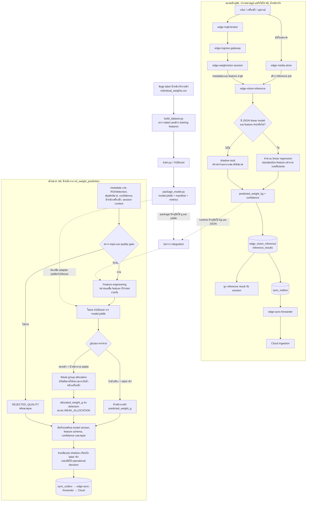

```mermaid
flowchart TD
    subgraph CURRENT[สถานะปัจจุบัน: ทำงานครบลูป แต่ยังไม่ใช่ ML น้ำหนักจริง]
        Device[กล้อง / เครื่องชั่ง / อุปกรณ์] --> MQTT[edge-mqtt-broker]
        MQTT --> Ingress[edge-ingress-gateway]
        Ingress --> Session[edge-weighvision-session]
        Device -->|อัปโหลดภาพ| Media[edge-media-store]
        Media -->|สร้าง inference job| Vision[edge-vision-inference]
        Session -->|metadata และ feature ล่าสุด| Vision

        Vision --> Runtime{มี JSON linear model<br/>และ feature ครบหรือไม่?}
        Runtime -->|ใช่| Linear[คำนวณ linear regression<br/>standardize feature แล้วรวม coefficients]
        Runtime -->|ไม่ใช่| Stub[shadow stub<br/>สร้างค่าจำลองจากขนาดไฟล์ภาพ]
        Linear --> CurrentOutput[predicted_weight_kg + confidence]
        Stub --> CurrentOutput
        CurrentOutput --> Results[(edge_vision_inference<br/>inference_results)]
        Results --> SessionResult[ผูก inference result กับ session]
        Results --> Outbox[(sync_outbox)]
        Outbox --> Sync[edge-sync-forwarder]
        Sync --> Cloud[Cloud ingestion]
    end

    subgraph TARGET[เป้าหมาย: ML น้ำหนักจาก ml_weight_prediction]
        RawCapture[metadata ภาพ, ROI/detection,<br/>depth/ขนาด, confidence,<br/>น้ำหนักเครื่องชั่ง, session context] --> Quality{ตรวจ input และ quality gate}
        Quality -->|ไม่ผ่าน| Reject[REJECTED_QUALITY<br/>พร้อมเหตุผล]
        Quality -->|ผ่าน| Feature[Feature engineering<br/>หน่วยและชื่อ feature ที่กำหนดร่วมกัน]
        Feature --> Model[โมเดล XGBoost จาก model.joblib]
        Model --> Evaluate{รูปแบบการทำนาย}

        Evaluate -->|ไก่ตัวเดียว + label จริง| Individual[น้ำหนักรายตัว<br/>predicted_weight_g]
        Evaluate -->|หลายตัว + น้ำหนักรวม stable| Allocation[Weak group allocation<br/>ปรับสัดส่วนให้ผลรวมเท่ากับน้ำหนักเครื่องชั่ง]
        Allocation --> WeakOutput[allocated_weight_g ต่อ detection<br/>สถานะ WEAK_ALLOCATION]
        Individual --> Persist[บันทึกผลพร้อม model version,<br/>feature schema, confidence และเหตุผล]
        WeakOutput --> Persist
        Reject --> Persist
        Persist --> Shadow[ประเมินแบบ shadow เทียบกับ label จริง<br/>ก่อนเปิดใช้ operational decision]
        Shadow --> OutboxTarget[(sync_outbox → edge-sync-forwarder → Cloud)]
    end

    Training[ข้อมูล label น้ำหนักจริงรายตัว<br/>individual_weights.csv] --> Dataset[build_dataset.py<br/>ตรวจ label และสร้าง training features]
    Dataset --> Train[train.py / XGBoost]
    Train --> Package[package_model.py<br/>model.joblib + manifest + metrics]
    Package -. ต้องเพิ่ม adapter joblib/XGBoost .-> Model

    CurrentOutput -. runtime ปัจจุบันใช้ kg และ JSON .-> Gap[ช่องว่าง integration]
    Package -. package ปัจจุบันใช้ g และ joblib .-> Gap
    Gap -. ต้องแก้ .-> Feature
```
