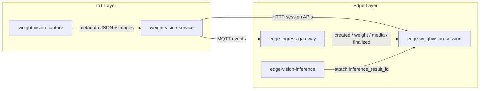
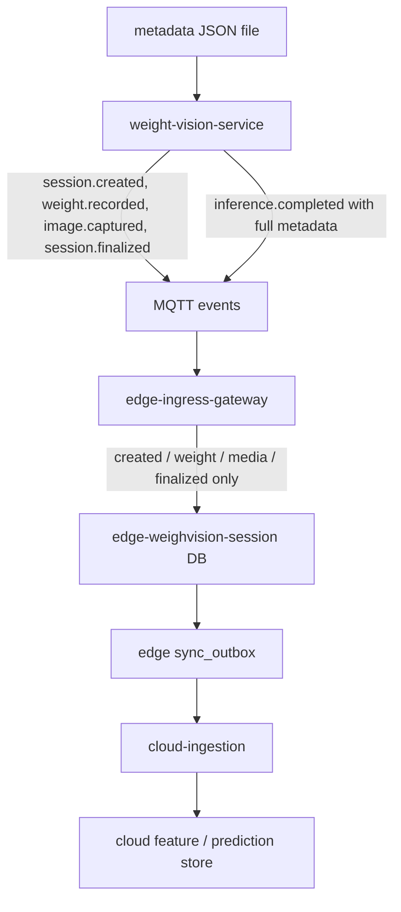

Purpose: Define the post-deployment enhancement plan for the FarmIQ IoT-layer WeighVision flow after field validation.
Scope: Weight accuracy, metadata traceability, model upgrade, and AI-readiness across IoT-to-Edge-to-Cloud integration.
Owner: FarmIQ Edge and IoT Architecture
Last updated: 2026-07-14

---

## Executive summary

Field deployment validated the core WeighVision operating model:

- IoT devices can capture image and scale data.
- Computer-vision metadata can be generated locally.
- Edge services can store sessions, media bindings, and final weights.
- The platform is structurally ready for offline-first farm operation.

The next phase is not a net-new build. It is a hardening and accuracy program focused on four workstreams:

1. Weight Estimation Validation
2. Computer Vision Model Upgrade
3. Metadata Pipeline Verification
4. AI Model Subscription and Edge Inference Enablement

This plan covers the full operational path, even though the main business outcome is owned by the IoT-layer, because the observed issues cross these components:

- `iot-layer/weight-vision-capture`
- `iot-layer/weight-vision-service`
- `edge-layer/edge-ingress-gateway`
- `edge-layer/edge-weighvision-session`
- `edge-layer/edge-vision-inference`
- `cloud-layer/cloud-ingestion`
- `cloud-layer/cloud-analytics-service`

### Batch 4 current status

`AI Model Subscription and Edge Inference Enablement` is now implemented and locally verified.

Closed outcomes:

- Cloud publishes a canonical WeighVision training dataset contract
- Cloud can train a real linear baseline from the field-audit dataset
- Cloud exports a real deployable package artifact with checksum and download path
- Cloud model package registry records can be created, listed, resolved, and downloaded
- site-level model subscription and acknowledgement APIs are implemented
- `cloud-api-gateway-bff` exposes the WeighVision model-control plane to downstream clients
- `edge-policy-sync` can cache the effective resolved package for one site
- `edge-vision-inference` can activate the package, run local shadow prediction, and enrich sync-back metadata

Primary references:

- [12-cloud-edge-ai-control-plane-pack.md](./12-cloud-edge-ai-control-plane-pack.md)
- [../contracts/weighvision-model-control-plane.contract.md](../contracts/weighvision-model-control-plane.contract.md)

Residual gaps:

- the current linear baseline is not promotion-ready because validation metrics are worse than the naive comparator on the current audit dataset
- one optional multi-service Docker Compose proof can still be run if operational sign-off requires end-to-end runtime evidence beyond local and component verification

---

## Current execution snapshot

### Batch 2 status

`Weight Estimation Validation` is completed at the audit, code-path, and parameter-baseline level.

Closed outcomes:

- field audit dataset generated from `129` metadata captures
- abnormal sessions categorized into:
  - sensor or unit mismatch
  - sensor stability or timing gap
  - finalize-path fallback risk
  - segmentation selection risk
  - depth or geometry defect
- Edge finalize path hardened to accept nested `payload.scale.weight_kg`
- IoT finalize payload hardened to emit top-level `final_weight_kg`
- baseline parameter set published for the next controlled field rerun

Primary references:

- [08-weight-estimation-audit-pack.md](./08-weight-estimation-audit-pack.md)
- [05-field-deployment-ticket-backlog.md](./05-field-deployment-ticket-backlog.md)

### Batch 2.1 status

`final_weight_kg` local end-to-end proof is completed on Docker Compose for the finalized session path.

Closed outcomes:

- Edge session API accepted nested `payload.scale.weight_kg`
- Edge persisted `weight_sessions.final_weight_kg`
- Edge emitted top-level `sync_outbox.payload_json.final_weight_kg`
- Cloud ingestion deduplicated the finalized event
- Cloud readmodel finalized the session and wrote a `finalized` measurement row
- local Cloud readmodel startup and event idempotency defects were fixed during proof

Primary references:

- [09-final-weight-local-smoke-runbook.md](./09-final-weight-local-smoke-runbook.md)
- [evidence/batch2.1-final-weight-smoke-2026-07-14.md](./evidence/batch2.1-final-weight-smoke-2026-07-14.md)

### Batch 3 status

`YOLO26 Model Upgrade` is completed at the runtime compatibility, local benchmark, and rollback-readiness level.

Closed outcomes:

- capture runtime generalized from a YOLO12-specific wrapper to profile-based ultralytics segmentation loading
- runtime config added for `active_model` and `fallback_model`
- startup fallback to baseline profile added when active-model initialization fails
- `camera-config/model/best.pt` locally promoted to the YOLO26 candidate with the prior YOLO12-era file preserved as backup
- active runtime now reads the promoted model from `iot-layer/camera-config/model/best.pt`, not directly from the training workspace
- YOLO26 compatibility smoke completed for configured profiles
- `weight-vision-capture` container smoke route added for rebuild/startup proof without live hardware dependency
- YOLO12 vs YOLO26 benchmark completed on one frozen `test` subset with `16` images
- reproducible rollout and rollback runbook published

Primary references:

- [10-yolo26-upgrade-pack.md](./10-yolo26-upgrade-pack.md)
- [evidence/batch3-yolo26-runtime-compat.json](./evidence/batch3-yolo26-runtime-compat.json)
- [evidence/batch3-yolo26-benchmark/benchmark-summary.md](./evidence/batch3-yolo26-benchmark/benchmark-summary.md)

---

## Current baseline

### Observed implementation baseline in this repository

- `iot-layer/weight-vision-capture/run_service.py` generates capture metadata with segmentation, bounding boxes, depth, height, width, area, calibration, and optional scale weight.
- `iot-layer/weight-vision-service/app/processor.py` scans `data/metadata/*.json`, uploads images, emits MQTT events, and calls `edge-weighvision-session` APIs for session creation, weight binding, media binding, and finalization.
- `edge-layer/edge-ingress-gateway/src/ingress/processor.ts` currently routes:
  - `weighvision.session.created`
  - `weighvision.weight.recorded`
  - `weighvision.image.captured`
  - `weighvision.inference.completed`
  - `weighvision.session.finalized`
- `edge-layer/edge-weighvision-session/prisma/schema.prisma` now stores session lifecycle, weight records, media bindings, raw capture metadata, and normalized selected-object features required for traceability.
- `edge-layer/edge-vision-inference/app/db.py` stores `predicted_weight_kg`, `confidence`, `model_version`, and a JSONB `metadata` field.
- `edge-layer/edge-vision-inference/app/inference_service.py` is still stub-oriented and currently returns deterministic placeholder inference output based on file properties, not a deployed production model.

### Why this matters

The field issue is not only "model accuracy". The current architecture mixes three concerns:

- ground-truth capture from the load cell
- geometric estimation from stereo and segmentation
- event-driven persistence into edge databases

If one of these layers is lossy, the team cannot determine whether a bad session came from:

- sensor instability
- mask quality
- depth calculation
- session binding
- event routing
- database mapping

---

## Current end-to-end flow

### Architecture note

The repository now contains enough code to capture, persist, and trace detailed computer-vision metadata through Edge and Cloud for one auditable session path. The remaining architectural gap is no longer metadata survivability. It is the Cloud-managed model subscription path that must become the canonical AI control plane before training, distributing, and running a robust AI weight prediction model with Cloud control and Edge inference.

---

## 1. Weight Estimation Validation

### Objective

Identify why some sessions report weight higher than actual and reduce error with evidence-backed changes.

### Field symptom

- Overestimation occurs only in some sessions.
- Root cause is not yet isolated.
- The issue may come from the interaction between scale reading, ROI geometry, segmentation quality, and depth-to-size conversion.

### Working hypotheses

| Hypothesis | Why it is plausible | Verification method |
| --- | --- | --- |
| Load-cell reading is captured before the animal stabilizes | `weight-vision-capture` supports post-capture weight windows and live serial sampling | Compare raw scale samples vs finalized weight per session |
| ROI scaling from board reference is slightly biased | board reference offsets and size scaling affect mm conversion | Recompute width/length/area from stored metadata using calibration checkpoints |
| Depth is sampled from a noisy point or wrong object region | current metadata records single detection point and single `depth_mm` per detection | Re-run sessions with alternative depth aggregations |
| Segmentation mask shape is wrong in partial occlusion cases | mask polygon drives area-related features | Overlay masks on problematic sessions and score contour quality |
| Multiple detections inside ROI contaminate the chosen target | metadata can contain multiple detections per capture | Check session rules for primary-object selection |
| Final session weight is taken from the wrong source | finalization can infer final weight from latest or initial weight if explicit value is absent | Trace finalized payload, bound weights, and DB final value for the same session |

### Investigation scope

1. Capture-layer validation
   - Verify raw scale sampling, stable-window logic, and `weight_source`.
   - Compare captured weight with the last stable reading before finalization.
   - Audit synchronization between image timestamp and scale timestamp.

2. Vision-layer validation
   - Review segmentation mask quality for false positives, clipped bodies, and merged objects.
   - Compare `bbox_xyxy`, `mask_xy`, `area_xy_mm2`, `height_mm`, `width_mm`, and `depth_mm` for normal vs abnormal sessions.
   - Recalculate height and area from saved metadata to confirm deterministic behavior.

3. Session-layer validation
   - Verify which weight is persisted as `initial_weight_kg`, `final_weight_kg`, and `session_weights.weight_kg`.
   - Confirm that image bindings and session finalization occur in the expected order.
   - Check whether the same session can receive multiple finalization paths.

4. Ground-truth correlation
   - Build a session audit dataset with:
     - session ID
     - capture timestamp
     - load-cell weight
     - calculated geometric features
     - final stored weight
   - Rank the most deviant sessions and compare against clean reference sessions.

### Deliverables

- Root cause report for abnormal sessions
- Parameter adjustment proposal
- Before/after validation dataset
- Updated operating thresholds for capture and session finalization

### Current completion state

This workstream is completed for repository-level audit and local finalized-path proof.

Produced artifacts:

- [08-weight-estimation-audit-pack.md](./08-weight-estimation-audit-pack.md)
- [09-final-weight-local-smoke-runbook.md](./09-final-weight-local-smoke-runbook.md)
- `docs/iot-layer/evidence/batch2-weight-audit-dataset.csv`
- `docs/iot-layer/evidence/batch2-weight-audit-summary.json`
- `docs/iot-layer/evidence/batch2.1-final-weight-smoke-2026-07-14.md`

Residual follow-up:

- direct live-bench proof of the suspected `lb -> kg` unit mismatch remains recommended before field closure

### Acceptance criteria

- Every abnormal session can be classified into a known error category.
- The team can reproduce the calculation path from raw metadata to stored final weight.
- A corrected parameter set is validated on field data before rollout.

---

## 2. Computer Vision Model Upgrade

### Objective

Upgrade the instance segmentation model from the current YOLO12-based path to YOLO26n-seg with measurable benefit and no regression in the field pipeline.

### Current state

- `iot-layer/weight-vision-capture/run_service.py` now resolves named model profiles and uses a generic ultralytics segmentation detector wrapper.
- `iot-layer/camera-config/model/runtime-config.yaml` now holds `active_model`, `fallback_model`, and per-profile threshold defaults.
- A dedicated YOLO26 training workspace already exists under `iot-layer/weight-vision-train-model-yolo26/`.

### Target state

- Support YOLO26-family segmentation weights in the capture and inference toolchain.
- Use `iot-layer/camera-config/model/best.pt` as the deployable runtime artifact after promotion, while keeping training outputs in the training workspace for benchmark and rollback reference only.
- Keep metadata output contract backward-compatible, or version it explicitly if changed.

### Upgrade tasks

| Task | Description | Exit criteria |
| --- | --- | --- |
| Compatibility check | Verify the runtime library, model loading, and segmentation output format | Model loads without code patching surprises |
| Config update | Update model path, confidence threshold, and segmentation-specific settings | Deployment config documented and reproducible |
| Output contract validation | Compare `class_id`, `confidence`, `bbox_xyxy`, `mask_xy`, and tracking behavior | JSON schema remains usable by downstream services |
| Pipeline adaptation | Adjust capture or post-processing if mask format or result objects changed | No broken metadata generation |
| Performance benchmark | Measure latency, FPS, memory, and startup cost on target hardware | Meets edge device constraints |
| Accuracy benchmark | Compare segmentation quality and downstream weight-related features | Better or equal field performance |

### Benchmark dimensions

| Metric | Current baseline | Candidate target |
| --- | --- | --- |
| Detection recall in ROI | To be measured | Must not regress |
| Mask quality on overlapping chickens | To be measured | Improve |
| Average per-frame latency | To be measured | Within edge budget |
| Peak memory usage | To be measured | Within device limit |
| Weight-estimation correlation | To be measured | Improve |

### Architecture guidance

- Do not replace the deployed model only because training exists.
- Treat model upgrade as a contract change until proven otherwise.
- Freeze a reference field dataset and run both models against the same sessions.
- Keep a rollback-ready config path for the previous YOLO12 model.

### Deliverables

- YOLO26 compatibility report
- Benchmark report: YOLO12 vs YOLO26
- Updated deployment/config instructions
- Go/no-go decision for field rollout

### Current completion state

This workstream is completed for local runtime readiness and controlled field-rollout preparation.

Produced artifacts:

- [10-yolo26-upgrade-pack.md](./10-yolo26-upgrade-pack.md)
- [11-weight-vision-capture-container-smoke-runbook.md](./11-weight-vision-capture-container-smoke-runbook.md)
- `docs/iot-layer/evidence/batch3-yolo26-runtime-compat.json`
- `docs/iot-layer/evidence/batch3-yolo26-container-smoke.json`
- `docs/iot-layer/evidence/batch3-yolo26-benchmark/benchmark-report.json`
- `docs/iot-layer/evidence/batch3-yolo26-benchmark/benchmark-summary.md`

Measured decision:

- `yolo26_candidate_local` materially outperformed the current baseline on the frozen subset in both segmentation quality and average latency
- the current runtime path has since been promoted to `camera-config/model/best.pt`, which now contains the YOLO26 candidate artifact

Residual follow-up:

- run one controlled field replay on target Edge hardware before switching the production default profile

---

## 3. Metadata Pipeline Verification

### Objective

Verify whether metadata produced by the computer-vision path is preserved, forwarded, and stored correctly across IoT, Edge, and Cloud services.

### Reference sample

Inspected sample metadata:

- `iot-layer/weight-vision-capture/data/metadata/20260211_150354.json`

Observed fields include:

- `detections[].confidence`
- `detections[].bbox_xyxy`
- `detections[].mask_xy`
- `detections[].depth_mm`
- `detections[].height_mm`
- `detections[].width_mm`
- `detections[].length_mm`
- `detections[].area_xy_mm2`
- `scale.weight_kg`
- `height_estimation.floor_depth_mm`
- `camera.focal_length_px`
- `camera.baseline_mm`

### Current data-flow diagram

### Important current-state finding

The current repository shows a metadata preservation gap:

- `weight-vision-service` publishes full metadata in:
  - `weighvision.inference.completed.payload.metadata`
  - `weighvision.session.finalized.payload`
- `edge-ingress-gateway` does not currently route `weighvision.inference.completed`.
- `edge-ingress-gateway` routes `weighvision.session.finalized`, but only forwards final weight and event identity to the session API.
- `edge-weighvision-session` persists session summary fields, not the full capture metadata.

Architecturally, this means the raw CV feature payload is generated, but is not yet guaranteed to survive into an Edge-to-Cloud query model that supports auditability, Cloud-side feature extraction, or Cloud-side AI training and prediction.

### JSON-to-database mapping matrix

| Requested field | Current JSON path | Current persistence path | Status | Required action |
| --- | --- | --- | --- | --- |
| Area | `detections[].area_xy_mm2` | Present in capture JSON only | Partial | Decide canonical unit and persist explicitly |
| Mask Area | Not stored as a named field; derived during capture from `mask_xy` | Not persisted | Gap | Add `mask_area_px2` or normalized equivalent |
| Bounding Box | `detections[].bbox_xyxy` | Present in capture JSON only | Partial | Persist raw or flattened bbox in feature store |
| Object Height | `detections[].height_mm` | Present in capture JSON only | Partial | Persist explicitly for analytics |
| Object Width | `detections[].width_mm` | Present in capture JSON only | Partial | Persist explicitly for analytics |
| Average Depth | Not found in sampled metadata | Not persisted | Gap | Add aggregation logic if required |
| Median Depth | Not found in sampled metadata | Not persisted | Gap | Add aggregation logic if required |
| Distance | No dedicated field; closest current candidates are `detections[].depth_mm` and `height_estimation.floor_depth_mm` | Not normalized | Gap | Define canonical `distance_mm` semantics |
| Confidence Score | `detections[].confidence` | Present in capture JSON only | Partial | Persist per detection or per selected object |

### Verification tasks

1. Contract verification
   - Document the canonical metadata schema produced by `weight-vision-capture`.
   - Version the schema if additional features are added.

2. API verification
   - Confirm which APIs accept raw metadata vs summary fields only.
   - Decide whether metadata should move through:
     - MQTT only
     - direct HTTP session attach
     - dedicated feature-ingestion API

3. Database verification
   - Confirm which tables own:
     - session lifecycle
     - weight readings
     - media binding
     - feature-level CV metadata at Edge
     - feature-level CV metadata at Cloud
     - AI prediction output at Cloud

4. Column mapping design
   - Separate:
     - audit/raw payload storage
     - normalized feature columns
     - model output columns
   - Avoid overloading `payload_json` in `sync_outbox` as the long-term analytics store.

### Target-state recommendation

Introduce a dedicated feature persistence contract with two stages:

- Edge raw payload store
  - immutable JSONB copy of the full capture metadata
  - tied to `session_id`, `media_id`, `tenant_id`, `trace_id`
- Cloud normalized feature store
  - explicit typed columns for area, width, height, depth, confidence, and future model inputs
  - receives synchronized feature-ready payloads from Edge

This gives the team:

- reproducible audit trails
- feature-level SQL access
- stable training-dataset extraction
- model-version-independent storage

### Deliverables

- Current-state data flow diagram
- JSON-to-database mapping specification
- Gap report for missing fields and missing routing
- Proposed feature-store schema for Edge

---

## 4. AI Model Subscription and Edge Inference Enhancement

### Objective

Build an AI-ready architecture where the Cloud layer owns model lifecycle and subscription control, while the Edge layer pulls the approved model and executes image-based weight prediction locally.

### Architecture principle

Do not couple the future prediction model directly to raw segmentation runtime or ad hoc session payloads. Introduce a stable feature contract first, train and version models in the Cloud layer, then let Edge sites subscribe to approved model versions and run inference locally.

### Control-plane decomposition

To make implementation executable, this workstream should be split into five delivery units with explicit boundaries:

| Work order | Control-plane concern | Primary implementation target |
| --- | --- | --- |
| `WO-IOT-FD-014` | Cloud training feature dataset contract | `cloud-feature-store`, `cloud-data-pipeline` |
| `WO-IOT-FD-017` | model registry and approval lifecycle | `cloud-feature-store` or dedicated registry path, `cloud-api-gateway-bff` |
| `WO-IOT-FD-018` | site or tenant model subscription API | `cloud-api-gateway-bff`, Edge subscription client |
| `WO-IOT-FD-019` | deployable package and manifest format | Cloud training/package pipeline, Edge validation path |
| `WO-IOT-FD-020` | Edge activation and fallback policy | `edge-vision-inference`, optional `edge-policy-sync` or local runtime config |
| `WO-IOT-FD-016` | end-to-end integration of the above | Cloud control plane + Edge inference + sync path |

### Cloud-to-Edge operating rule

The intended operating rule is:

- Cloud owns training, approval, versioning, and subscription state.
- Edge pulls only approved package versions for its site or tenant scope.
- Edge validates and activates the package locally before inference.
- Edge runs prediction locally to reduce network transfer and per-request Cloud inference cost.
- Edge persists prediction output and sync metadata back to Cloud for evaluation, governance, and later model improvement.

### Proposed feature set

#### Vision features

- segmentation-derived area
- mask area
- bounding box width and height
- object width and height in mm
- depth statistics
- confidence score
- camera position and calibration context

#### Farm context features

- chicken age
- breed
- farm
- barn
- camera position
- session time

#### Ground truth

- weight standard
- load-cell weight

### Proposed future flow

```mermaid
flowchart LR
  cam["Camera + Load Cell"]
  seg["Segmentation"]
  dep["Depth Estimation"]
  edge_feat["Edge Feature Packaging"]
  sync["Edge to Cloud Sync"]
  store["Cloud Feature Store"]
  model_reg["Cloud Model Registry"]
  sub["Cloud Model Subscription Control"]
  edge_model["Edge Deployed Model"]
  db["Edge Prediction Store"]
  dash["Dashboard"]

  cam --> seg
  seg --> dep
  dep --> edge_feat
  edge_feat --> sync
  sync --> store
  store --> model_reg
  model_reg --> sub
  sub --> edge_model
  edge_model --> db
  db --> dash
```

### Development tasks

| Stream | Tasks |
| --- | --- |
| Data engineering | design Cloud training schema, backfill synchronized sessions, handle missing values, normalize numeric features |
| Modeling | benchmark linear regression, XGBoost, LightGBM, neural network, and hybrid options in Cloud training workflows |
| Integration | create Edge-to-Cloud feature packaging, Cloud feature ingestion, model registry, subscription control, versioned Edge prediction outputs, dashboard exposure |
| Governance | track dataset lineage, model version, feature version, training cutoff date, and site subscription state |

### Recommended rollout phases

1. Feature-store readiness
   - No model rollout yet.
   - Focus on trustworthy, queryable training data.

2. Offline model experimentation
   - Train against labeled historic sessions.
   - Compare against simple baselines before advanced models.

3. Shadow prediction mode with Cloud-managed Edge execution
   - Distribute an approved model from Cloud without affecting operational decisions.
   - Run predictions locally on Edge and compare prediction vs load-cell truth after synchronization.

4. Controlled production usage
   - Expose prediction confidence and model version.
   - Keep load-cell-based truth as the operational reference until acceptance thresholds are met.

### Deliverables

- Cloud feature dataset design
- Edge-to-Cloud training dataset generation pipeline
- Baseline model comparison report
- Cloud model registry and Edge subscription integration design
- model package specification and validation contract
- Edge fallback and activation policy

---

## Priority and sequencing

| Priority | Workstream | Status | Reason |
| --- | --- | --- | --- |
| High | Weight Estimation Validation | Completed with local proof | Root cause categories, finalize-path hardening, and `final_weight_kg` end-to-end proof completed |
| High | Metadata Verification | Completed | Traceability path closed from JSON metadata to Edge and Cloud |
| Medium | YOLO26 Integration | Completed with local benchmark proof | Runtime compatibility, frozen-dataset benchmark, and rollback config are in place |
| Medium | AI Model Subscription and Edge Inference | In progress - control-plane MVP implemented | Real model training and full subscribed shadow execution remain outstanding |

### Recommended execution order

1. Close metadata traceability gaps first.
2. Run weight-estimation root-cause analysis on real sessions.
3. Benchmark YOLO26 only after the current evaluation dataset is frozen.
4. Start AI modeling only after feature schema and storage are stable.

---

## Expected outcome

After this enhancement program, the IoT-to-Edge WeighVision flow should provide:

- improved weight accuracy with explainable error categories
- verified metadata traceability from capture JSON to Edge and Cloud persistence
- controlled support for YOLO26n-seg
- a reusable Edge-to-Cloud feature pipeline for Cloud-trained, Edge-executed AI weight prediction
- a clear separation between raw operational events, normalized features, and model outputs

---

## Related references

- [IoT-layer overview](00-overview.md)
- [MQTT topic map](03-mqtt-topic-map.md)
- [Edge inference pipeline](../edge-layer/03-edge-inference-pipeline.md)
- [Weight anomaly analysis](weight-anomaly-analysis-2026-06-23.html)
- [YOLO26 upgrade pack](10-yolo26-upgrade-pack.md)
- [YOLO26 training workspace](../../iot-layer/weight-vision-train-model-yolo26/README.md)
