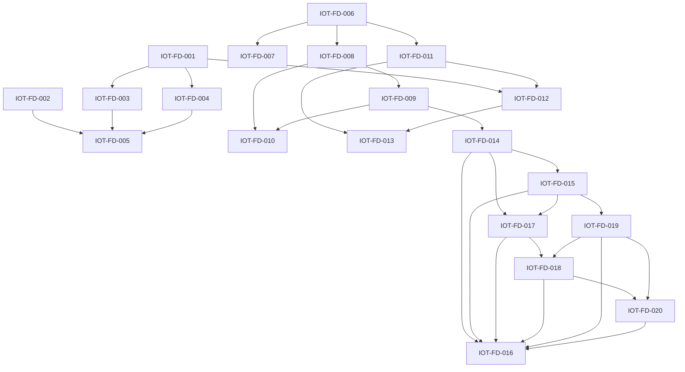

Purpose: Convert the post-deployment IoT-layer enhancement plan into executable epics and tickets.
Scope: Ticket breakdown, implementation sequence, dependencies, acceptance criteria, and suggested agent roles.
Owner: FarmIQ Edge and IoT Architecture
Last updated: 2026-07-14

---

## Executive summary

If we move from planning to implementation, the correct shape is:

1. split the work into 4 epics
2. execute P0 and P1 tickets in dependency order
3. assign each ticket to a clear engineering role or agent role
4. require evidence and acceptance criteria before closing each ticket

This backlog is derived from:

- [04-field-deployment-enhancement-plan.md](04-field-deployment-enhancement-plan.md)
- [Work Orders index](work-orders/README.md)

The goal is to make the plan implementable as a delivery board, not just a strategy document.

---

## Current execution status

### Batch 1: metadata traceability

Status: `Completed and locally verified`

Completed work orders:

- `WO-IOT-FD-006` Define canonical metadata schema
- `WO-IOT-FD-007` Add routing for inference metadata events
- `WO-IOT-FD-008` Persist raw capture metadata on Edge
- `WO-IOT-FD-009` Add Edge-to-Cloud normalized feature mapping
- `WO-IOT-FD-010` Build metadata verification report/query pack

Validated local evidence:

- session: `sess-int-20260714-004`
- capture: `cap-20260714-004`
- create event: `e11b0921-9d45-4da4-a6fc-68ce74bbadca`
- inference event: `021856ac-a754-44a5-bc3a-f707b9e84eb7`

Exit gate result:

- one session traces from JSON metadata to Edge persistence and Cloud persistence
- critical feature fields are preserved in Edge typed columns and Cloud event payloads
- query pack and runbook exist for repeatable verification

### Batch 2: weight anomaly investigation

Status: `Completed with audit evidence and code-path hardening`

Completed work orders:

- `WO-IOT-FD-001` Build field session audit dataset
- `WO-IOT-FD-002` Reconstruct final weight calculation path
- `WO-IOT-FD-003` Validate scale stability and capture timing
- `WO-IOT-FD-004` Analyze segmentation-depth parameter sensitivity
- `WO-IOT-FD-005` Publish corrected parameter set and validation report

Validated evidence:

- metadata audit dataset built from `129` field capture JSON files
- summary evidence stored in `docs/iot-layer/evidence/batch2-weight-audit-summary.json`
- existing field anomaly evidence cross-referenced in `docs/iot-layer/weight-anomaly-analysis-2026-06-23.html`
- finalize path hardened so nested `payload.scale.weight_kg` and explicit `final_weight_kg` are both supported
- local finalized-session proof completed through Edge and Cloud readmodel with:
  - runbook: `docs/iot-layer/09-final-weight-local-smoke-runbook.md`
  - evidence: `docs/iot-layer/evidence/batch2.1-final-weight-smoke-2026-07-14.md`
  - verified session: `sess-fw-20260714-113013`

Exit gate result:

- abnormal sessions are explainable as sensor/unit, timing/stability, finalize-path, segmentation, or depth/geometry categories
- the team can identify whether a bad session comes from sensor, timing, segmentation, depth, or finalize fallback behavior
- a new parameter baseline is defined for the next controlled field rerun
- finalized weight can be traced locally from nested finalize payload to Cloud `weighvision_measurement`

### Batch 3: YOLO26 model hardening

Status: `Completed with local compatibility, benchmark, and rollback evidence`

Completed work orders:

- `WO-IOT-FD-011` Validate YOLO26 runtime compatibility
- `WO-IOT-FD-012` Build YOLO12 vs YOLO26 benchmark harness
- `WO-IOT-FD-013` Add rollout config and rollback path

Validated evidence:

- compatibility evidence stored in `docs/iot-layer/evidence/batch3-yolo26-runtime-compat.json`
- container smoke evidence stored in `docs/iot-layer/evidence/batch3-yolo26-container-smoke.json`
- benchmark evidence stored in:
  - `docs/iot-layer/evidence/batch3-yolo26-benchmark/benchmark-report.json`
  - `docs/iot-layer/evidence/batch3-yolo26-benchmark/benchmark-summary.md`
- rollout and rollback pack published in `docs/iot-layer/10-yolo26-upgrade-pack.md`
- runtime now supports `active_model` plus `fallback_model` profile selection
- current promoted runtime artifact is `iot-layer/camera-config/model/best.pt`

Exit gate result:

- YOLO26 profiles load and run in the IoT capture runtime
- YOLO12 and YOLO26 candidate were benchmarked on the same frozen dataset subset
- model promotion and rollback can be performed through runtime config without source patching

### Batch 4: Cloud-Edge AI control plane

Status: `Completed with local verification`

Completed work orders:

- `WO-IOT-FD-014` Design Cloud AI training feature dataset
- `WO-IOT-FD-015` Train baseline weight prediction models and publish deployable model package
- `WO-IOT-FD-016` Integrate Cloud model subscription and Edge prediction pipeline end-to-end
- `WO-IOT-FD-017` Design and implement Cloud model registry
- `WO-IOT-FD-018` Design and implement model subscription API
- `WO-IOT-FD-019` Define deployable model package format
- `WO-IOT-FD-020` Define Edge fallback and version activation policy

Validated evidence:

- Cloud ML API tests passed for dataset contract, bootstrap baseline, real train-baseline export, subscription resolve, and acknowledgement flow
- Edge runtime tests passed for active package activation and fallback handling
- Edge job-service tests passed for sync-back payload enrichment
- real field-audit dataset training produced:
  - package version `wv-shadow-field-baseline-2026.07.14`
  - artifact `cloud-layer/cloud-ml-model-service/artifacts/weighvision/tenant-batch4-real/wv-shadow-field-baseline-2026.07.14.tar.gz`
- real package artifact was activated locally in Edge shadow runtime
- `cloud-api-gateway-bff` TypeScript build passed
- `edge-policy-sync` TypeScript build passed
- `cloud-weighvision-readmodel` TypeScript build passed

Exit gate result:

- Cloud has dataset contract, baseline training route, registry, subscription API, and downloadable package artifact
- Edge can resolve and cache which package it should activate for one site
- Edge can activate the package, execute local shadow prediction, and attach package metadata to sync-back payloads
- activation and fallback policy is explicit in resolved manifest metadata
- current baseline-v1 is plumbing-complete but not promotion-ready because validation quality is worse than the naive comparator

---

## Recommended delivery model

### Delivery wave 1: traceability and root-cause readiness

Focus:

- metadata traceability
- session auditability
- field anomaly reproduction

Why first:

- without this, the team cannot trust later model benchmarking or AI training

### Delivery wave 2: model-path hardening

Focus:

- YOLO26 compatibility
- benchmark harness
- rollout controls

Why second:

- upgrade only after the current baseline is measurable

### Delivery wave 3: Cloud-managed model subscription and Edge inference

Focus:

- edge-to-cloud feature store path
- cloud-side model training and registry
- edge-side subscribed inference integration

Why third:

- AI work depends on stable features and validated ground truth; the next concrete step is completing real baseline training and the end-to-end subscribed shadow execution path

---

## Agent skill model

For this backlog, "Agent Skill" should be used as a role-based execution pattern. Each ticket should be assigned to one primary role.

| Agent Skill / Role | Main responsibility |
| --- | --- |
| `Architecture Analyst` | clarify contracts, boundaries, and target-state design |
| `Repo Auditor` | trace current code paths, tables, payloads, and gaps |
| `Python CV Engineer` | capture pipeline, segmentation, depth, feature extraction, model runtime |
| `Node Edge Engineer` | ingress routing, APIs, session service, outbox integration |
| `Data Engineer` | schema design, feature tables, extraction jobs, dataset quality |
| `ML Engineer` | training set design, baseline models, benchmark comparison |
| `QA Benchmark Agent` | field test plan, replay, benchmark evidence, regression checks |
| `Documentation Agent` | update specs, decision logs, runbooks, and evidence docs |

### Recommended multi-agent execution pattern

Use a lead architect flow:

1. `Architecture Analyst` defines scope and target contract.
2. `Repo Auditor` confirms current-state implementation and evidence.
3. `Node Edge Engineer` and `Python CV Engineer` implement the technical path.
4. `Data Engineer` normalizes the data model and dataset outputs.
5. `QA Benchmark Agent` validates with reproducible evidence.
6. `Documentation Agent` updates the operational record.

---

## Epic overview

| Epic | Title | Priority | Goal |
| --- | --- | --- | --- |
| `EPIC-IOT-FD-01` | Weight Estimation Validation | P0 | isolate root cause of overestimated sessions |
| `EPIC-IOT-FD-02` | Metadata Pipeline Verification | P0 | guarantee traceability from JSON metadata to Edge and Cloud persistence |
| `EPIC-IOT-FD-03` | YOLO26 Model Upgrade | P1 | support and benchmark YOLO26 runtime profiles safely |
| `EPIC-IOT-FD-04` | AI Weight Prediction Enablement | P1 | build reusable Edge-to-Cloud feature pipeline, Cloud model control plane, and Edge inference path |

---

## Ticket board

| Ticket ID | Epic | Title | Priority | Primary Agent Skill | Main services |
| --- | --- | --- | --- | --- | --- |
| `IOT-FD-001` | `EPIC-IOT-FD-01` | Build field session audit dataset | P0 | `Data Engineer` | `iot-layer/weight-vision-capture`, `edge-weighvision-session` |
| `IOT-FD-002` | `EPIC-IOT-FD-01` | Reconstruct final weight calculation path | P0 | `Repo Auditor` | `weight-vision-service`, `edge-ingress-gateway`, `edge-weighvision-session` |
| `IOT-FD-003` | `EPIC-IOT-FD-01` | Validate scale stability and capture timing | P0 | `Python CV Engineer` | `weight-vision-capture` |
| `IOT-FD-004` | `EPIC-IOT-FD-01` | Analyze segmentation-depth parameter sensitivity | P1 | `Python CV Engineer` | `weight-vision-capture` |
| `IOT-FD-005` | `EPIC-IOT-FD-01` | Publish corrected parameter set and validation report | P1 | `QA Benchmark Agent` | IoT + Edge evidence |
| `IOT-FD-006` | `EPIC-IOT-FD-02` | Define canonical metadata schema | P0 | `Architecture Analyst` | IoT and Edge contracts |
| `IOT-FD-007` | `EPIC-IOT-FD-02` | Add routing for inference metadata events | P0 | `Node Edge Engineer` | `edge-ingress-gateway` |
| `IOT-FD-008` | `EPIC-IOT-FD-02` | Persist raw capture metadata on Edge | P0 | `Node Edge Engineer` | `edge-weighvision-session` or dedicated store |
| `IOT-FD-009` | `EPIC-IOT-FD-02` | Add Edge-to-Cloud normalized feature mapping | P0 | `Data Engineer` | Edge DB schema + Cloud ingestion contract |
| `IOT-FD-010` | `EPIC-IOT-FD-02` | Build metadata verification report/query pack | P1 | `Documentation Agent` | docs + SQL/report artifacts |
| `IOT-FD-011` | `EPIC-IOT-FD-03` | Validate YOLO26 runtime compatibility | P1 | `Python CV Engineer` | `weight-vision-capture`, `weight-vision-train-model-yolo26` |
| `IOT-FD-012` | `EPIC-IOT-FD-03` | Build YOLO12 vs YOLO26 benchmark harness | P1 | `QA Benchmark Agent` | IoT CV pipeline |
| `IOT-FD-013` | `EPIC-IOT-FD-03` | Add rollout config and rollback path | P1 | `Node Edge Engineer` | deployment/config docs |
| `IOT-FD-014` | `EPIC-IOT-FD-04` | Design Cloud AI training feature dataset | P1 | `Data Engineer` | Cloud feature schema + labels |
| `IOT-FD-015` | `EPIC-IOT-FD-04` | Train baseline weight prediction models and publish deployable model package | P2 | `ML Engineer` | Cloud training workspace + model package |
| `IOT-FD-016` | `EPIC-IOT-FD-04` | Integrate Cloud model subscription and Edge prediction pipeline end-to-end | P2 | `Node Edge Engineer` + `ML Engineer` | Edge-to-Cloud sync + Cloud model control + Edge inference + dashboard path |
| `IOT-FD-017` | `EPIC-IOT-FD-04` | Design and implement Cloud model registry | P1 | `Architecture Analyst` + `ML Engineer` | Cloud model registry + metadata store |
| `IOT-FD-018` | `EPIC-IOT-FD-04` | Design and implement model subscription API | P1 | `Node Edge Engineer` | Cloud subscription API + Edge client |
| `IOT-FD-019` | `EPIC-IOT-FD-04` | Define deployable model package format | P1 | `ML Engineer` + `Data Engineer` | model artifact format + manifest |
| `IOT-FD-020` | `EPIC-IOT-FD-04` | Define Edge fallback and version activation policy | P1 | `Node Edge Engineer` + `Architecture Analyst` | Edge runtime policy + version fallback |

---

## Detailed tickets

## `EPIC-IOT-FD-01` Weight Estimation Validation

### `IOT-FD-001` Build field session audit dataset

- Objective:
  create one reference dataset that joins session IDs, load-cell values, capture metadata, and final persisted values
- Scope:
  - extract sample sessions from field runs
  - join `session_weights`, `weight_sessions`, media bindings, and metadata JSON
  - label normal vs anomalous sessions
- Output:
  - CSV/SQL extract
  - anomaly shortlist
  - reproducible extraction query or script
- Dependencies:
  - none
- Acceptance criteria:
  - at least one auditable dataset exists for abnormal sessions
  - each row can trace back to source session and capture artifact

### `IOT-FD-002` Reconstruct final weight calculation path

- Objective:
  prove exactly how one finalized weight value is derived from IoT event to Edge DB
- Scope:
  - trace `weight-vision-service`
  - trace `edge-ingress-gateway`
  - trace `edge-weighvision-session/finalize`
- Output:
  - sequence diagram
  - source-of-truth mapping for `initial_weight_kg`, `final_weight_kg`, and `session_weights.weight_kg`
- Dependencies:
  - none
- Acceptance criteria:
  - the team can explain one session path end-to-end without ambiguity

### `IOT-FD-003` Validate scale stability and capture timing

- Objective:
  verify whether unstable or mistimed load-cell readings are the root cause
- Scope:
  - inspect stable-window logic
  - compare raw scale samples and captured weight
  - assess timestamp alignment between image and scale
- Output:
  - timing analysis
  - recommended stable-window parameters
- Dependencies:
  - `IOT-FD-001`
- Acceptance criteria:
  - stable capture rules are documented and validated on field sessions

### `IOT-FD-004` Analyze segmentation-depth parameter sensitivity

- Objective:
  measure how ROI, mask quality, and depth sampling affect estimated size and inferred weight features
- Scope:
  - compare abnormal and normal sessions
  - test alternate point/depth aggregation strategies
  - review mask clipping and multiple detections in ROI
- Output:
  - sensitivity matrix
  - proposed parameter changes
- Dependencies:
  - `IOT-FD-001`
  - `IOT-FD-003`
- Acceptance criteria:
  - at least one explainable error pattern is tied to a measurable parameter

### `IOT-FD-005` Publish corrected parameter set and validation report

- Objective:
  convert findings into a controlled operating baseline
- Scope:
  - define approved parameter set
  - replay or retest candidate sessions
  - document before/after results
- Output:
  - validation report
  - approved config baseline
- Dependencies:
  - `IOT-FD-002`
  - `IOT-FD-003`
  - `IOT-FD-004`
- Acceptance criteria:
  - corrected settings reduce error on the validation dataset

---

## `EPIC-IOT-FD-02` Metadata Pipeline Verification

### `IOT-FD-006` Define canonical metadata schema

- Objective:
  establish one authoritative schema for capture metadata and downstream mapping
- Scope:
  - define required and optional fields
  - define units and naming rules
  - define schema versioning
- Output:
  - metadata contract doc
  - JSON example
  - field ownership map
- Dependencies:
  - none
- Acceptance criteria:
  - every requested feature field has a defined source and semantic meaning

### `IOT-FD-007` Add routing for inference metadata events

- Objective:
  close the current gap where `weighvision.inference.completed` is not routed by ingress
- Scope:
  - add routing rule
  - choose destination API or metadata ingestion path
  - preserve trace and tenant context
- Output:
  - code change in `edge-ingress-gateway`
  - route-level tests
- Dependencies:
  - `IOT-FD-006`
- Acceptance criteria:
  - metadata-bearing inference events are no longer dropped

### `IOT-FD-008` Persist raw capture metadata on Edge

- Objective:
  guarantee raw metadata is durably stored for audit and replay
- Scope:
  - add raw JSONB storage model
  - persist by `session_id`, `media_id`, `tenant_id`, `trace_id`
  - ensure idempotent writes
- Output:
  - schema change
  - persistence service/API
  - tests
- Dependencies:
  - `IOT-FD-006`
  - `IOT-FD-007`
- Acceptance criteria:
  - a full raw metadata payload can be queried for any stored session

### `IOT-FD-009` Add Edge-to-Cloud normalized feature mapping

- Objective:
  convert raw metadata into synchronized feature columns and contracts for Cloud analytics and ML
- Scope:
  - create Edge-to-Cloud feature mapping design
  - map area, bbox, width, height, depth, confidence
  - decide per-detection vs selected-object granularity
- Output:
  - schema and sync contract updates
  - mapper job or service
  - field mapping spec
- Dependencies:
  - `IOT-FD-006`
  - `IOT-FD-008`
- Acceptance criteria:
  - requested feature fields are synchronized to a Cloud-consumable structure without manual JSON parsing

### `IOT-FD-010` Build metadata verification report/query pack

- Objective:
  make metadata verification operational for engineering and QA
- Scope:
  - create verification checklist
  - provide example queries and report layout
  - document known gaps and expected values
- Output:
  - report template
  - SQL/query examples
  - evidence checklist
- Dependencies:
  - `IOT-FD-008`
  - `IOT-FD-009`
- Acceptance criteria:
  - engineers can verify one session’s metadata flow in a repeatable way

---

## `EPIC-IOT-FD-03` YOLO26 Model Upgrade

Current status:

- completed for local runtime compatibility, benchmark proof, and rollback readiness
- primary reference: `docs/iot-layer/10-yolo26-upgrade-pack.md`

### `IOT-FD-011` Validate YOLO26 runtime compatibility

- Objective:
  confirm the current capture stack can load and use YOLO26 segmentation models safely, with the deployable runtime artifact resolved through `camera-config/model/best.pt`
- Scope:
  - model loading
  - output object compatibility
  - segmentation output handling
- Output:
  - compatibility spike report
  - required runtime/config changes
- Dependencies:
  - `IOT-FD-006`
- Acceptance criteria:
  - model integration risks are documented before rollout work starts

### `IOT-FD-012` Build YOLO12 vs YOLO26 benchmark harness

- Objective:
  benchmark the old and new model on the same field dataset
- Scope:
  - freeze dataset
  - compare latency, memory, mask quality, and downstream feature quality
  - capture reproducible benchmark commands
- Output:
  - benchmark report
  - decision-ready evidence pack
- Dependencies:
  - `IOT-FD-001`
  - `IOT-FD-011`
- Acceptance criteria:
  - both models are compared on the same evaluation basis

### `IOT-FD-013` Add rollout config and rollback path

- Objective:
  make model upgrade deployable and reversible
- Scope:
  - config switch for model selection
  - threshold tuning
  - rollback instructions
- Output:
  - deployment config update
  - rollback runbook
- Dependencies:
  - `IOT-FD-011`
  - `IOT-FD-012`
- Acceptance criteria:
  - operations can switch or roll back the model without ad hoc patching

---

## `EPIC-IOT-FD-04` AI Weight Prediction Enablement

### `IOT-FD-014` Design Cloud AI training feature dataset

- Objective:
  define the canonical Cloud training dataset contract
- Scope:
  - features
  - labels
  - missing-data rules
  - normalization rules
- Output:
  - dataset schema
  - extraction spec
  - feature dictionary
- Dependencies:
  - `IOT-FD-009`
- Acceptance criteria:
  - the team can generate a Cloud training dataset repeatedly from synchronized production-like data

### `IOT-FD-015` Train baseline weight prediction models and publish deployable model package

- Objective:
  create the first measurable AI baseline and a deployable model package that Edge can subscribe to
- Scope:
  - linear regression
  - XGBoost
  - LightGBM
  - optional neural-network baseline
- Output:
  - experiment report
  - baseline metrics
  - recommended next model family
- Dependencies:
  - `IOT-FD-014`
- Acceptance criteria:
  - at least one baseline outperforms naive heuristics on the validation split

### `IOT-FD-016` Integrate Cloud model subscription and Edge prediction pipeline end-to-end

- Objective:
  integrate the control plane and execution plane into one end-to-end flow without replacing operational ground truth
- Scope:
  - Cloud registry, subscription, package, and fallback components working together
  - Edge model pull, version activation, and local inference
  - Edge model output persistence and synchronization
  - prediction versioning
  - optional dashboard exposure
- Output:
  - end-to-end integrated subscription and prediction pipeline
  - Edge prediction pipeline
  - queryable prediction results
  - comparison against load-cell truth
- Dependencies:
  - `IOT-FD-014`
  - `IOT-FD-015`
  - `IOT-FD-017`
  - `IOT-FD-018`
  - `IOT-FD-019`
  - `IOT-FD-020`
- Acceptance criteria:
  - Edge predictions can be generated from a Cloud-managed subscribed model without affecting the live weighing decision path

### `IOT-FD-017` Design and implement Cloud model registry

- Objective:
  build the Cloud-side source of truth for model versions, metadata, approval state, and deployability
- Scope:
  - model metadata schema
  - model version lifecycle
  - approval and active-state rules
  - model lookup for Edge subscription
- Output:
  - registry schema and API design
  - registry implementation plan or service
  - model lifecycle rules
- Dependencies:
  - `IOT-FD-014`
  - `IOT-FD-015`
- Acceptance criteria:
  - one approved model version can be published and discovered by downstream subscription workflows

### `IOT-FD-018` Design and implement model subscription API

- Objective:
  provide a Cloud API that lets Edge sites discover, subscribe to, and retrieve the correct approved model version
- Scope:
  - subscription create/update/read flow
  - site or tenant scoping
  - version resolution rules
  - Edge pull contract
- Output:
  - subscription API contract
  - service implementation plan
  - Edge client contract
- Dependencies:
  - `IOT-FD-017`
  - `IOT-FD-019`
- Acceptance criteria:
  - an Edge site can resolve which model version it should run using a supported Cloud API

### `IOT-FD-019` Define deployable model package format

- Objective:
  standardize the model artifact package that Cloud publishes and Edge consumes
- Scope:
  - artifact contents
  - manifest schema
  - checksum and compatibility metadata
  - runtime requirements
- Output:
  - model package specification
  - manifest schema
  - packaging and validation rules
- Dependencies:
  - `IOT-FD-015`
- Acceptance criteria:
  - one package format is defined that Edge can validate before activation

### `IOT-FD-020` Define Edge fallback and version activation policy

- Objective:
  ensure Edge can activate a subscribed model safely and fall back deterministically if the new version fails
- Scope:
  - version activation rules
  - health checks before activation
  - fallback trigger rules
  - rollback target selection
- Output:
  - activation policy
  - fallback policy
  - runtime decision rules
- Dependencies:
  - `IOT-FD-018`
  - `IOT-FD-019`
- Acceptance criteria:
  - Edge runtime can decide whether to activate, reject, or roll back a model version using explicit policy

---

## Dependency map

---

## Recommended first sprint

Start with these four tickets:

1. `IOT-FD-006` Define canonical metadata schema
2. `IOT-FD-001` Build field session audit dataset
3. `IOT-FD-002` Reconstruct final weight calculation path
4. `IOT-FD-007` Add routing for inference metadata events

Why these first:

- they remove ambiguity from the system
- they unlock evidence-based debugging
- they prevent model work from running on unreliable data flow

---

## Definition of done for this program

The enhancement program should be considered operationally ready when:

- session anomalies are explainable using stored evidence
- metadata is preserved from capture to Edge and Cloud persistence
- YOLO26 can be benchmarked and rolled back safely
- feature extraction supports repeatable ML dataset generation
- Cloud-managed, Edge-executed AI prediction can run with versioned outputs after Edge-to-Cloud synchronization

---

## Related references

- [04-field-deployment-enhancement-plan.md](04-field-deployment-enhancement-plan.md)
- [IoT-layer overview](00-overview.md)
- [MQTT topic map](03-mqtt-topic-map.md)
- [YOLO26 upgrade pack](10-yolo26-upgrade-pack.md)
- [Weight-vision-capture container smoke runbook](11-weight-vision-capture-container-smoke-runbook.md)
- [Work Orders index](work-orders/README.md)
