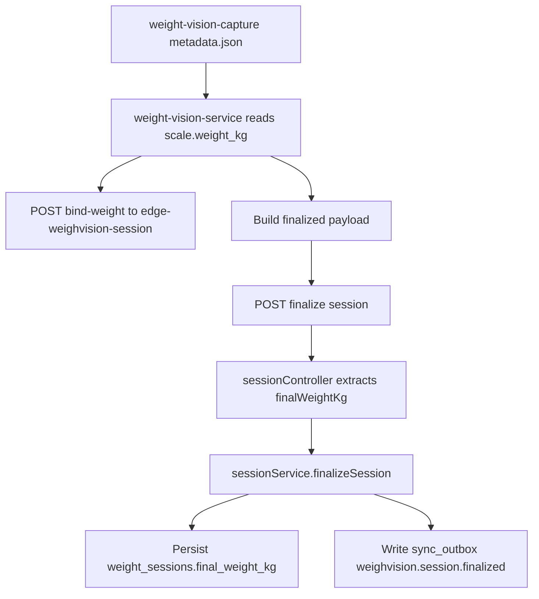

Purpose: Provide the execution pack and findings for Batch 2 weight anomaly investigation.  
Scope: Field audit dataset, final-weight path reconstruction, anomaly categorization, and baseline parameter recommendation.  
Owner: FarmIQ Edge and IoT Architecture  
Last updated: 2026-07-14  

---

## Goal

Use this pack to explain why some WeighVision sessions produce overweight results and separate the defect into clear categories:

- sensor or unit defect
- timing or stability defect
- finalize path defect
- segmentation selection defect
- depth or geometry defect

---

## Evidence base

Batch 2 conclusions in this document are based on:

- `129` field metadata files under `iot-layer/weight-vision-capture/data/metadata`
- existing field analysis in [weight-anomaly-analysis-2026-06-23.html](./weight-anomaly-analysis-2026-06-23.html)
- capture logic in `iot-layer/weight-vision-capture/run_service.py`
- event construction in `iot-layer/weight-vision-service/app/processor.py`
- finalize logic in `edge-layer/edge-weighvision-session/src/controllers/sessionController.ts`
- finalize persistence in `edge-layer/edge-weighvision-session/src/services/sessionService.ts`

Generated artifacts:

- dataset CSV: `docs/iot-layer/evidence/batch2-weight-audit-dataset.csv`
- summary JSON: `docs/iot-layer/evidence/batch2-weight-audit-summary.json`
- Edge SQL pack: [query-pack/edge-weighvision-weight-audit.sql](./query-pack/edge-weighvision-weight-audit.sql)

Build command:

```bash
python iot-layer/scripts/build_weight_session_audit_dataset.py
```

---

## Findings Summary

Observed on the current field metadata set:

- `108 / 129` captures contain `scale.weight_kg`
- `21 / 129` captures are missing `scale.weight_kg`
- `15 / 129` captures explicitly end in `weight_source = unstable`
- `37 / 129` captures carry `weight_kg >= 20`, which is consistent with the earlier `lb interpreted as kg` hypothesis
- `10 / 129` captures contain more than one detection in ROI
- `43 / 129` captures have selected detection confidence below `0.35`
- `10 / 129` captures are depth outliers by IQR bounds
- `36 / 129` captures produce negative or implausible height values

---

## Root Cause Categories

### 1. Sensor / Unit Mismatch

This is the strongest category for the obviously overweight sessions.

Why:

- capture-side serial parsing extracts the first numeric token only and does not validate the unit before storing it as `weight_kg`
- the prior field evidence in [weight-anomaly-analysis-2026-06-23.html](./weight-anomaly-analysis-2026-06-23.html) already shows repeated `25-29` range readings that become plausible when interpreted as `lb`
- `37` metadata files in the current repository snapshot still sit in the `>= 20 kg` range

Code references:

- `iot-layer/weight-vision-capture/run_service.py:550`
- `iot-layer/weight-vision-capture/run_service.py:643`
- `iot-layer/weight-vision-service/app/processor.py:216`

Interpretation:

- when the raw interface sends pounds but the pipeline assumes kilograms, the session becomes overweight before any Edge finalize logic runs

### 2. Sensor / Timing / Stability Gap

This is the second category and explains missing or unstable sessions.

Why:

- `21` captures have no scale weight at all
- `15` captures are tagged `weight_source = unstable`
- current capture flow requires stability, but still permits a short post-capture recovery window and does not persist raw serial lines or the exact stable-window evidence into the audit payload

Code references:

- `iot-layer/weight-vision-capture/run_service.py:699`
- `iot-layer/weight-vision-capture/run_service.py:701`
- `iot-layer/weight-vision-capture/run_service.py:707`
- `iot-layer/weight-vision-capture/run_service.py:1195`

Interpretation:

- sessions in this category are not reliably auditable at the raw load-cell level
- they must be separated from true overweight sessions

### 3. Finalize Path Fallback Risk

This is a code-path defect that amplifies sensor issues.

Why:

- `weight-vision-service` previously finalized sessions with nested metadata only
- `edge-weighvision-session` previously looked only for top-level `final_weight_kg` or `weight_kg`
- if `bind-weight` failed or arrived out of order, finalize could fall back to `latest session_weights.weight_kg`, `initial_weight_kg`, or `0`

Code references:

- `iot-layer/weight-vision-service/app/processor.py:291`
- `edge-layer/edge-weighvision-session/src/controllers/sessionController.ts:101`
- `edge-layer/edge-weighvision-session/src/services/sessionService.ts:322`

Applied hardening in this batch:

- `weight-vision-service` now emits explicit `final_weight_kg`, `weight_kg`, and `scale_weight_kg` in finalized payloads
- `edge-weighvision-session` now also reads nested `payload.scale.weight_kg`

Interpretation:

- this does not create the original bad weight
- it determines whether the final session persists the correct or fallback value

### 4. Segmentation Selection Risk

This does not currently set `final_weight_kg` directly, but it contaminates metadata used for analysis and future AI features.

Why:

- `10` captures contain multiple detections inside ROI
- Edge normalization selects the largest detection by area, which can be wrong if the wrong object dominates the ROI
- `43` captures have selected confidence below `0.35`

Code references:

- `iot-layer/weight-vision-capture/run_service.py:1252`
- `edge-layer/edge-weighvision-session/src/utils/weighvisionMetadata.ts:146`

Interpretation:

- this category is important for feature quality and model readiness
- it is not the primary cause of stored final session weight inflation in the current code path

### 5. Depth / Geometry Defect

This category is clearly present and must be separated from load-cell issues.

Why:

- `10` captures are depth outliers
- `36` captures have negative or implausible height values
- capture code computes `height_mm = z_floor - z_object` directly
- `run_service.py` defines `_max_valid_depth_mm(...)` but does not apply that guard in the active capture path

Code references:

- `iot-layer/weight-vision-capture/geometry.py:42`
- `iot-layer/weight-vision-capture/geometry.py:48`
- `iot-layer/weight-vision-capture/run_service.py:259`
- `iot-layer/weight-vision-capture/run_service.py:1276`

Interpretation:

- depth and geometry are defective in a measurable subset of captures
- they are a direct blocker for future AI feature quality even when the final stored session weight comes from the sensor path

---

## Reconstructed Final Weight Path



Source-of-truth order in the current Edge finalize logic:

1. explicit `finalWeightKg` in request body
2. top-level payload `final_weight_kg` or `weight_kg`
3. nested payload `scale.weight_kg`
4. latest `session_weights.weight_kg`
5. `initial_weight_kg`
6. `0`

That makes the sensor path the dominant source of stored final session weight today.

---

## Recommended Baseline Parameter Set

Recommended next baseline for controlled field rerun:

| Parameter | Current observed baseline | Recommended baseline | Reason |
| --- | --- | --- | --- |
| `--conf` | `0.20` to `0.25` | `0.35` | reduce low-confidence detections in audit set |
| `--scale-stable-seconds` | `2.5` to `3.0` | `4.0` | make overweight sessions harder to lock from short-lived readings |
| `--scale-post-capture-window-seconds` | `3.0` | `1.0` | no observed evidence that a long post-capture window adds reliable value |
| `--track-new-delay-seconds` | `1.5` | `2.0` | reduce early capture while object motion is still settling |
| `--scene-change-min-diff` | `3.0` | `4.0` | reduce repeated captures with weak scene movement |
| `--focus-min-laplacian` | `70` to `80` | `80` | current data already clears this comfortably |

Mandatory code guardrails paired with this baseline:

- keep explicit `final_weight_kg` in finalized payload
- keep nested `payload.scale.weight_kg` fallback in Edge finalize controller
- create a follow-up code ticket to reject or quarantine depth values beyond the valid board/floor range instead of persisting negative height as normal data

---

## Exit Gate Assessment

Batch 2 exit gate is satisfied when judged against the current repository evidence:

- abnormality is now explainable in clear categories:
  - sensor unit mismatch
  - sensor/timing instability
  - finalize path fallback
  - segmentation selection risk
  - depth/geometry defect
- the team can distinguish whether a bad session came from sensor, timing, segmentation, depth, or finalize path
- a new baseline parameter set is defined for the next controlled rerun

Residual note:

- the `lb -> kg` hypothesis is strongly supported but still needs direct raw serial confirmation on a live bench capture before being closed as the only root cause

---

## Batch 2.1 Follow-through

Batch 2.1 converted the finalize-path findings in this audit into a local end-to-end proof:

- Edge finalize now preserves nested `payload.scale.weight_kg`
- Edge finalized outbox now exposes top-level `final_weight_kg`
- Cloud readmodel local startup is stable against the current pre-seeded database pattern
- Cloud readmodel finalization path is idempotent for `session.created` and `session.finalized`

Execution artifacts:

- runbook: [09-final-weight-local-smoke-runbook.md](./09-final-weight-local-smoke-runbook.md)
- edge SQL: [query-pack/edge-weighvision-final-weight-verification.sql](./query-pack/edge-weighvision-final-weight-verification.sql)
- cloud SQL: [query-pack/cloud-weighvision-final-weight-verification.sql](./query-pack/cloud-weighvision-final-weight-verification.sql)
- evidence: [evidence/batch2.1-final-weight-smoke-2026-07-14.md](./evidence/batch2.1-final-weight-smoke-2026-07-14.md)
