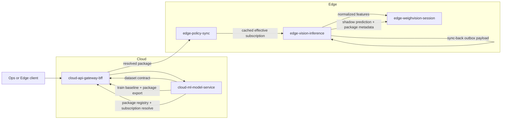

Purpose: Record the implemented Batch 4 and Batch 5 Cloud-Edge AI control plane for WeighVision, including real baseline training, deployable package export, Edge activation, shadow sync-back, and final Cloud readmodel proof.  
Scope: `WO-IOT-FD-014` through `WO-IOT-FD-020` with emphasis on `WO-IOT-FD-015` and `WO-IOT-FD-016`.  
Owner: FarmIQ Edge and Cloud Architecture  
Last updated: 2026-07-15

---

## Executive summary

Batch 4 and Batch 5 are now closed at repository, unit-test, and Docker Compose smoke-verification level.

Closed outcomes:

- Cloud publishes the canonical WeighVision dataset contract
- Cloud trains a real baseline model from the field-audit dataset
- Cloud exports a real `.tar.gz` model package with checksum and download endpoint
- Cloud model registry and site subscription APIs are implemented
- Edge can resolve, pull, activate, and execute the subscribed package in shadow mode
- Edge sync-back payload now carries package, version, activation, and feature-schema metadata
- the same Cloud session readmodel now shows both finalized truth and independent shadow prediction evidence

Important quality note:

- the first real linear baseline is operationally valid as a deployable shadow package
- it is not promotion-ready for broader rollout because its validation metrics underperform the naive comparator on the current audit dataset

Primary evidence:

- [batch4-control-plane-verification-2026-07-14.md](./evidence/batch4-control-plane-verification-2026-07-14.md)
- [iot-origin-e2e-20260715-095521.html](./evidence/iot-origin-e2e-20260715-095521.html)
- [iot-origin-e2e-20260715-095521.json](./evidence/iot-origin-e2e-20260715-095521.json)
- [weighvision-model-control-plane.contract.md](../contracts/weighvision-model-control-plane.contract.md)

---

## Work-order status

| Work order | Status | Notes |
| --- | --- | --- |
| `WO-IOT-FD-014` | Completed | canonical dataset contract published |
| `WO-IOT-FD-015` | Completed with baseline-v1 evidence | real training, metrics, package export, and download path implemented |
| `WO-IOT-FD-016` | Completed with Docker E2E proof | package pull, activation, local shadow inference, and Cloud readmodel sync-back path implemented |
| `WO-IOT-FD-017` | Completed | Cloud registry APIs implemented |
| `WO-IOT-FD-018` | Completed | Cloud subscription and acknowledgement APIs implemented |
| `WO-IOT-FD-019` | Completed | deployable package manifest contract implemented |
| `WO-IOT-FD-020` | Completed | activation and fallback policy implemented on Edge |

---

## Implemented architecture

### Service responsibilities

- `cloud-ml-model-service`
  - publishes dataset contract
  - trains the baseline model
  - exports package artifacts
  - owns package registry
  - owns site subscription state and acknowledgement records

- `cloud-api-gateway-bff`
  - exposes public WeighVision control-plane endpoints
  - proxies train-baseline and subscription routes

- `edge-policy-sync`
  - caches the effective package for one `tenant_id` and `site_id`

- `edge-vision-inference`
  - activates packages from local path, `file://`, or HTTP(S)
  - validates checksum
  - loads the package manifest and model payload
  - executes local shadow inference from normalized features
  - enriches sync-back payload with package and runtime metadata

- `edge-weighvision-session`
  - persists the prediction outcome as `weighvision.inference.completed` into the Edge sync outbox
  - keeps finalized load-cell truth as the authoritative final-weight path

---

## Cloud API surface

### Dataset contract

- `GET /api/v1/ml/weighvision/dataset-contract`
- `GET /api/v1/weighvision/dataset-contract`

### Baseline training

- `POST /api/v1/ml/weighvision/train-baseline`
- `POST /api/v1/weighvision/train-baseline`

### Package download

- `GET /api/v1/ml/weighvision/model-packages/{packageId}/download`

### Package registry

- `POST /api/v1/ml/weighvision/model-packages`
- `GET /api/v1/ml/weighvision/model-packages`
- `GET /api/v1/ml/weighvision/model-packages/{packageId}`

### Site subscription

- `PUT /api/v1/ml/weighvision/model-subscriptions/sites/{siteId}`
- `GET /api/v1/ml/weighvision/model-subscriptions/sites/{siteId}`
- `GET /api/v1/ml/weighvision/model-subscriptions/sites/{siteId}/resolve`
- `POST /api/v1/ml/weighvision/model-subscriptions/sites/{siteId}/ack`

---

## Package and runtime contract

### Package contents

Each trained package now exports:

- `manifest.json`
- `model/model.json`
- `schema/feature-schema.json`
- `evidence/metrics-summary.json`

### Package manifest fields in use

- `packageVersion`
- `runtimeFamily`
- `runtimeVersion`
- `featureSchemaVersion`
- `checksumSha256`
- `packageUri`
- `entrypoint`
- `channel`
- `activationPolicy`
- `fallbackPolicy`
- `metadata`

### Edge runtime metadata now emitted

- `package_id`
- `package_version`
- `feature_schema_version`
- `activation_source`
- `fallback_engaged`
- `prediction_mode`
- `features_used`

### Edge refresh endpoint

- `POST /api/v1/inference/models/refresh`

This forces `edge-vision-inference` to resolve the latest cached subscription and activate the package immediately.

---

## Verification completed

Verified locally:

- `cloud-ml-model-service` tests passed: `5`
- `edge-vision-inference` tests passed: `13`
- `cloud-api-gateway-bff` TypeScript build passed
- `edge-policy-sync` TypeScript build passed
- `cloud-weighvision-readmodel` TypeScript build passed
- real baseline training executed on `docs/iot-layer/evidence/batch2-weight-audit-dataset.csv`
- real exported package activated and executed in Edge shadow mode
- Docker Compose smoke verification passed across Cloud and Edge stacks with mock session data
- Docker Compose end-to-end session proof passed with:
  - Cloud-approved package activation
  - Edge local shadow inference
  - acked Edge outbox prediction event
  - Cloud readmodel session showing `final_weight_kg = 3.33` and `predicted_weight_kg = 0.2444`

Key artifact produced:

- `cloud-layer/cloud-ml-model-service/artifacts/weighvision/tenant-batch4-real/wv-shadow-field-baseline-2026.07.14.tar.gz`

Container smoke proof:

- `scripts/batch4-container-smoke.ps1`
- `scripts/batch5-e2e-smoke.ps1`
- `scripts/iot-origin-e2e-html-report.ps1`
- `scripts/export-iot-origin-session-report.ps1`
- stack overlays:
  - `cloud-layer/docker-compose.batch4-smoke.yml`
  - `edge-layer/docker-compose.batch4-smoke.yml`
  - `cloud-layer/docker-compose.batch5-e2e.yml`
  - `edge-layer/docker-compose.batch5-e2e.yml`

Observed smoke result:

- trained package published and subscribed successfully
- `edge-policy-sync` cached the same package ID resolved by Cloud
- `edge-vision-inference` refreshed to `status = ready`
- local shadow inference returned:
  - `prediction_mode = shadow`
  - `activation_source = manifest`
  - `package_version = wv-shadow-docker-smoke-2026.07.14`
  - `package_id` equal to the trained package ID
  - `stub_mode = false`

Observed Batch 5 E2E result:

- latest verified Cloud session: `sess-batch5-e2e-6e4d33a8f8104734916b4da2cbabcd75`
- finalized truth path remained `3.33`
- synced shadow prediction was `0.2444`
- Edge outbox prediction event was `acked`
- Cloud readmodel returned package and feature-schema metadata on the same session

Observed IoT-origin E2E result:

- latest verified IoT-origin session: `sess-iot-origin-674d4ad7013244b2bd2a6cb583aef24a`
- IoT-layer mock capture uploaded image set and truth weight through `weight-vision-service`
- Edge persisted canonical capture metadata with `metadataSchemaVersion = 1.0` and `featureSchemaVersion = 1.0`
- Edge executed local shadow inference with package `wv-shadow-iot-origin-20260715-095521`
- Cloud readmodel preserved finalized truth `3.33` and stored independent shadow prediction `0.2444`
- ingress valid-message delta for the verified run was `8`
- HTML and JSON evidence were written under `docs/iot-layer/evidence/`

---

## Operational conclusion

Batch 4 and Batch 5 are ready to support Cloud-governed, Edge-executed shadow prediction with Docker-backed local proof.

What is ready now:

- package governance
- subscription control
- activation and fallback policy
- local package execution
- sync-back audit metadata
- containerized end-to-end smoke proof on mock data
- Cloud readmodel session-level proof that prediction does not override the finalized truth path

What should happen next:

1. improve `WO-IOT-FD-015` model quality with better features or model families because baseline-v1 is worse than naive validation performance
2. harden the `WO-IOT-FD-018` subscription acknowledgement path because local package activation currently succeeds even though the ack endpoint still returns `500`
3. extend `WO-IOT-FD-016` from local mock proof to production shadow telemetry and promotion gates if operational sign-off is needed beyond container verification
